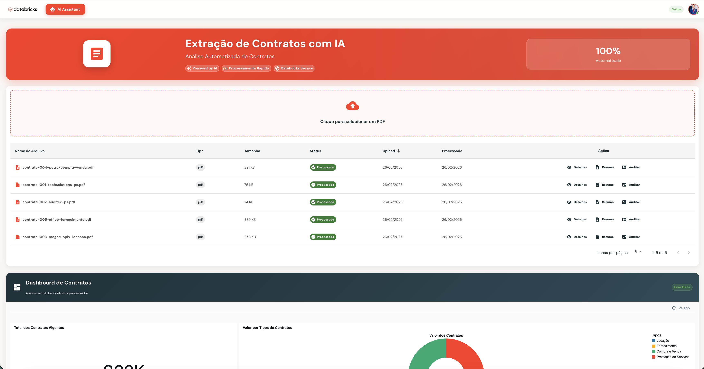

# 📄 Contract Extract App

**Sistema de Extração Inteligente de Contratos**

Automatiza a extração de informações de contratos em PDF usando IA generativa.

<p align="center">
  
</p>

---

## 📋 O que é?

O Contract Extract App é uma aplicação que processa automaticamente contratos em PDF e extrai informações estruturadas:

| Campo | Descrição | Exemplo |
|-------|-----------|---------|
| **Tipo de Contrato** | Classificação do contrato | Prestação de Serviços |
| **Nome do Contrato** | Identificador do documento | Contrato nº 001/2025 |
| **Contratante** | Empresa que contrata | Empresa ABC Ltda |
| **Contratada** | Empresa contratada | Consultoria XYZ |
| **Valor** | Montante do contrato | R$ 150.000,00 |
| **Datas** | Assinatura, início e fim | 01/01/2025 a 31/12/2025 |
| **Resumo** | Síntese do contrato | Serviços de consultoria... |

---

## 🚀 Instalação

### Pré-requisitos

1. **Python 3.10+** (apenas biblioteca padrão, sem venv necessário)
2. **Databricks CLI v0.200+** configurado
3. **Acesso ao Databricks Workspace** com:
   - Unity Catalog habilitado
   - SQL Warehouse disponível
   - Permissão para criar Apps e Jobs

> **Nota:** O `setup.py` usa apenas Python padrão e Databricks CLI. Não precisa instalar dependências extras nem criar virtualenv.

### Passo 1: Instalar Databricks CLI

```bash
# Opção 1: via pip
pip install databricks-cli

# Opção 2: via brew (macOS)
brew install databricks
```

### Passo 2: Configurar Profile

```bash
databricks configure --profile meu-workspace
```

Informe:
- **Host**: URL do seu workspace (ex: `https://adb-xxx.azuredatabricks.net`)
- **Token**: Personal Access Token

### Passo 3: Clonar ou Extrair o Projeto

```bash
git clone <repo-url> contract-extract
cd contract-extract
```

### Passo 4: Executar Setup

```bash
python setup.py \
    --profile SEU_WORKSPACE \
    --catalog SEU_CATALOGO \
    --warehouse-id SEU_WAREHOUSE_ID \
    --env prod
```

> **Parâmetros:**
> - `--profile`: Profile do Databricks CLI (configurado no passo 2)
> - `--catalog`: Nome do Unity Catalog onde as tabelas serão criadas
> - `--warehouse-id`: ID do SQL Warehouse (encontre em SQL Warehouses no Databricks)
> - `--env`: Ambiente (`dev`, `staging`, ou `prod`)

O script irá automaticamente:
- ✅ Criar secrets no Databricks
- ✅ Criar tabelas no Unity Catalog
- ✅ Criar funções SQL de IA (SUMMARIZE_CONTRACT_DATA, EXTRACT_CONTRACT_DATA)
- ✅ Gerar `app.yaml` a partir dos templates `app.{env}.example.yaml` (placeholders substituídos pelos parâmetros do setup)
- ✅ Fazer deploy dos Jobs (com trigger automático por arquivo)
- ✅ Fazer deploy do App
- ✅ Configurar permissões

### Passo 5: (Opcional) Criar Genie Space

Para habilitar consultas em linguagem natural sobre os contratos:

```bash
python setup.py \
    --profile SEU_WORKSPACE \
    --catalog SEU_CATALOGO \
    --warehouse-id SEU_WAREHOUSE_ID \
    --env prod \
    --skip-secrets --skip-tables --skip-deploy \
    --create-genie
```

Isso cria um Genie Space com perguntas pré-configuradas como:
- "Quantos contratos temos na base?"
- "Quais contratos vencem este ano?"
- "Liste os 10 maiores contratos por valor"

### Passo 6: Configurar Instruções do Genie Space

Para melhorar a qualidade das respostas do chat, configure as **instruções do Genie Space** manualmente:

1. No Databricks, vá em **AI/BI > Genie Spaces**
2. Abra o Genie Space criado (ex: `Contract Extract - PROD`)
3. Clique em **Settings** (ícone de engrenagem)
4. Na seção **Instructions**, cole o texto abaixo:

```
## Regras Importantes

### Idioma
- Responda SEMPRE em português brasileiro
- O usuário faz perguntas em português, mas alguns dados podem estar em inglês

### Campos Principais da Tabela contract_extract

| Campo | Descrição | Tipo |
|-------|-----------|------|
| path | Caminho do arquivo PDF | STRING |
| summarize | Resumo do contrato | STRING |
| tipo_contrato | Tipo do contrato | STRING |
| nome_contrato | Nome/número do contrato | STRING |
| contratante | Nome do contratante | STRING |
| contratado | Nome da contratada | STRING |
| valor_total | Valor do contrato | STRING |
| moeda | Moeda (BRL, USD, etc) | STRING |
| data_assinatura | Data de assinatura | STRING |
| data_inicio_vigencia | Data de início | STRING |
| data_fim_vigencia | Data de término | STRING |
| prazo_vigencia | Prazo de vigência | STRING |
| objeto_contrato | Objeto do contrato | STRING |
| forma_pagamento | Forma de pagamento | STRING |
| condicoes_pagamento | Condições de pagamento | STRING |
| clausula_rescisao | Cláusula de rescisão | STRING |
| multa_rescisao | Multa de rescisão | STRING |
| garantias | Garantias | STRING |
| confidencialidade | Cláusula de confidencialidade | STRING |
| foro | Foro competente | STRING |
| observacoes | Observações | STRING |

### Datas
- Formato: YYYY-MM-DD
- Use CAST ou funções de data para comparações

### Valores
- valor_total é STRING, use CAST para ordenar por valor

### Exemplos de SQL

-- Total de contratos
SELECT COUNT(*) as total FROM contract_extract

-- Contratos por tipo
SELECT tipo_contrato, COUNT(*) as qtd 
FROM contract_extract 
GROUP BY tipo_contrato 
ORDER BY qtd DESC

-- Maiores contratos (valor)
SELECT nome_contrato, contratante, contratado, valor_total 
FROM contract_extract 
ORDER BY CAST(valor_total AS DOUBLE) DESC 
LIMIT 10

-- Contratos que vencem em 2025
SELECT nome_contrato, contratado, data_fim_vigencia 
FROM contract_extract 
WHERE data_fim_vigencia LIKE '%2025%'

-- Buscar por empresa
SELECT * FROM contract_extract 
WHERE contratante ILIKE '%empresa%' 
   OR contratado ILIKE '%empresa%'
```

5. Clique em **Save**

> **Por que isso é necessário?** O Genie usa IA para gerar SQL. As instruções ajudam a traduzir corretamente as perguntas do usuário para consultas SQL.

---

## ⚙️ Parâmetros do Setup

### Parâmetros Obrigatórios

| Parâmetro | Descrição | Exemplo |
|-----------|-----------|---------|
| `--profile` | Profile do Databricks CLI | `meu-workspace` |
| `--catalog` | Nome do Unity Catalog | `meu_catalogo` |
| `--warehouse-id` | ID do SQL Warehouse | `abc123def456` |

### Parâmetros Opcionais

| Parâmetro | Descrição | Default |
|-----------|-----------|---------|
| `--env`, `-e` | Ambiente (dev/staging/prod) | `dev` |
| `--schema`, `-s` | Schema do Unity Catalog | `contracts` |
| `--app-name`, `-a` | Nome base do app | `contract-extract` |
| `--scope-prefix` | Prefixo do scope de secrets | `contract-extract` |
| `--target`, `-t` | Target do deploy | (mesmo que --env) |
| `--agent-endpoint` | Endpoint do Multi-Agent | `""` |
| `--audio-endpoint` | Endpoint do Whisper | `""` |

### Flags de Skip

| Flag | Descrição |
|------|-----------|
| `--skip-secrets` | Não criar secrets |
| `--skip-tables` | Não criar tabelas |
| `--skip-deploy` | Não fazer deploy do bundle |
| `--skip-permissions` | Não configurar permissões |

### Flags de Criação

| Flag | Descrição |
|------|-----------|
| `--create-genie` | Criar Genie Space para consultas |
| `--upload-samples` | Fazer upload dos PDFs de exemplo |

---

## 🌍 Ambientes

O sistema suporta múltiplos ambientes isolados:

| Ambiente | Comando | Secrets | App |
|----------|---------|---------|-----|
| Desenvolvimento | `--env dev` | `contract-extract-dev` | `contract-extract-dev` |
| Homologação | `--env staging` | `contract-extract-staging` | `contract-extract-staging` |
| Produção | `--env prod` | `contract-extract-prod` | `contract-extract-prod` |

### Exemplo: Setup de Produção

```bash
python setup.py \
    --profile meu-workspace \
    --catalog prod_catalog \
    --warehouse-id xyz789 \
    --env prod \
    --create-genie
```

### Exemplo: Setup de Desenvolvimento

```bash
python setup.py \
    --profile meu-workspace \
    --catalog dev_catalog \
    --warehouse-id abc123 \
    --env dev \
    --upload-samples
```

### Exemplo: Redeploy apenas do App

```bash
python setup.py \
    --profile meu-workspace \
    --catalog prod_catalog \
    --warehouse-id xyz789 \
    --env prod \
    --skip-secrets --skip-tables
```

---

## 🏗️ Arquitetura

```
┌─────────────────────────────────────────────────────────────┐
│                     INTERFACE WEB                           │
│        Upload │ Dashboard │ Chat IA │ Visualização          │
└────────────────────────┬────────────────────────────────────┘
                         │
┌────────────────────────┴────────────────────────────────────┐
│                   BACKEND (FastAPI)                         │
│              Databricks App + OAuth                         │
└─────────────────────────┬───────────────────────────────────┘
                          │
┌─────────────────────────┴───────────────────────────────────┐
│                    UNITY CATALOG                            │
│                                                             │
│  📄 contract_extract    Contratos processados (principal)   │
│  📄 contract_parsed     Contratos parseados (texto)         │
│  📄 contract_track      Rastreamento de PDFs                │
│  📁 files (Volume)      Armazenamento de PDFs               │
│  🔧 SUMMARIZE_CONTRACT_DATA   Função SQL de IA              │
│  🔧 EXTRACT_CONTRACT_DATA     Função SQL de IA              │
└─────────────────────────┬───────────────────────────────────┘
                          │
┌─────────────────────────┴───────────────────────────────────┐
│                   DATABRICKS JOB                            │
│                                                             │
│  📥 track_pdfs       Detecta novos PDFs no Volume           │
│  📋 list_files       Lista arquivos para processar          │
│  🤖 parse_and_extract   Extrai dados com IA                 │
│                                                             │
│  ⚡ Trigger: File Arrival (automático quando PDF é upload)  │
└─────────────────────────────────────────────────────────────┘
```

### Fluxo de Processamento

1. **Upload**: Usuário faz upload de PDF via App
2. **Trigger**: Job é disparado automaticamente (File Arrival)
3. **Track**: Sistema detecta novo arquivo no Volume
4. **Parse**: PDF é convertido para texto
5. **Extract**: IA extrai campos estruturados (tipo, valor, datas, etc)
6. **Store**: Dados salvos na tabela `contract_extract`
7. **Query**: Usuário consulta via Dashboard ou Genie Space

---

## 📊 Funcionalidades

### Upload de Contratos
- Interface drag-and-drop para PDFs
- Processamento automático em background
- Notificação de conclusão

### Dashboard
- KPIs: Total de contratos, valor total, novos esta semana
- Gráficos de distribuição por tipo
- Timeline de processamento

### Extração com IA
- Identificação automática de campos
- Sumarização do contrato
- Extração de datas e valores

### Chat com Genie (Opcional)
- Consultas em linguagem natural
- "Quais contratos vencem este mês?"
- "Liste contratos com valor acima de R$ 100.000"

---

## 🗄️ Tabelas Unity Catalog

| Tabela | Descrição |
|--------|-----------|
| `contract_track` | Rastreamento de PDFs no volume |
| `contract_parsed` | Texto extraído dos PDFs |
| `contract_extract` | Dados estruturados (tabela principal) |

### Campos da Tabela `contract_extract`

| Campo | Tipo | Descrição |
|-------|------|-----------|
| `path` | STRING | Caminho do PDF no Volume |
| `summarize` | STRING | Resumo do contrato |
| `tipo_contrato` | STRING | Tipo (Prestação de Serviços, etc) |
| `nome_contrato` | STRING | Nome/número do contrato |
| `contratante` | STRING | Contratante |
| `contratado` | STRING | Contratada |
| `valor_total` | STRING | Valor do contrato |
| `moeda` | STRING | Moeda (BRL, USD) |
| `data_assinatura` | STRING | Data de assinatura |
| `data_inicio_vigencia` | STRING | Data de início |
| `data_fim_vigencia` | STRING | Data de término |
| `prazo_vigencia` | STRING | Prazo de vigência |
| `objeto_contrato` | STRING | Objeto do contrato |
| `forma_pagamento` | STRING | Forma de pagamento |
| `condicoes_pagamento` | STRING | Condições |
| `clausula_rescisao` | STRING | Cláusula de rescisão |
| `multa_rescisao` | STRING | Multa de rescisão |
| `garantias` | STRING | Garantias |
| `confidencialidade` | STRING | Confidencialidade |
| `foro` | STRING | Foro competente |
| `observacoes` | STRING | Observações |

---

## 🔧 Manutenção

### Executar Job Manualmente

No Databricks Workspace:
1. Acesse **Workflows**
2. Encontre o job (ex: `contracts-extract-prod`)
3. Clique em **Run Now**

### Reprocessar Contrato

Para reprocessar um contrato específico:

```sql
-- 1. Remover da tabela de extração
DELETE FROM seu_catalog.contracts.contract_extract 
WHERE file_path = '/Volumes/seu_catalog/contracts/files/contrato.pdf';

-- 2. Resetar status no track
UPDATE seu_catalog.contracts.contract_track 
SET status = 'pending' 
WHERE file_path = '/Volumes/seu_catalog/contracts/files/contrato.pdf';

-- 3. Executar o job manualmente
```

### Otimizar Tabelas

Após cargas grandes, execute no **SQL Editor**:

```sql
USE CATALOG seu_catalog;
USE SCHEMA contracts;

OPTIMIZE contract_extract ZORDER BY (contract_type, contractor_name, extracted_at);
ANALYZE TABLE contract_extract COMPUTE STATISTICS;
```

### Verificar Logs

```bash
# Listar jobs
databricks jobs list --profile meu-workspace

# Ver execução específica
databricks jobs get-run-output --run-id <RUN_ID> --profile meu-workspace

# Logs do App
databricks apps get-logs contract-extract-prod --profile meu-workspace
```

---

## 🐛 Troubleshooting

### Erro: Databricks CLI não encontrado

```bash
pip install databricks-cli
databricks configure --profile meu-workspace
```

### Erro: Warehouse não encontrado

Verifique se o warehouse está ativo:

```bash
databricks sql warehouses list --profile meu-workspace
```

### Erro: Permissão negada no Unity Catalog

Verifique se seu usuário tem permissões:
- `USE CATALOG` no catalog especificado
- `USE SCHEMA` no schema
- `CREATE TABLE` no schema
- `CREATE FUNCTION` no schema

### App não inicia

Verifique os logs do App no Databricks:
1. Acesse **Compute > Apps** no menu lateral
2. Clique no app `contract-extract`
3. Veja os logs na aba **Logs**

### PDF não foi processado

1. Verifique se o arquivo está no Volume:
   ```sql
   SELECT * FROM seu_catalog.contracts.contract_track 
   WHERE file_path LIKE '%nome_do_arquivo%';
   ```

2. Verifique se o Job executou:
   - Acesse **Workflows** > `contracts-extract-prod`
   - Veja as execuções recentes

3. Verifique erros no Job:
   - Clique na execução com erro
   - Veja os logs de cada task

---

## 📂 Estrutura do Projeto

```
contract-extract/
├── setup.py                 # Script de instalação
├── README.md                # Esta documentação
├── databricks.yml           # Configuração do Bundle
│
├── app/
│   ├── app.dev.example.yaml # Template DEV (setup.py lê daqui e substitui placeholders)
│   ├── app.prod.example.yaml# Template PROD (idem)
│   ├── app.yaml             # Gerado pelo setup.py ou deploy (não versionar)
│   ├── backend/
│   │   └── main.py          # Aplicação FastAPI
│   ├── frontend/
│   │   └── src/             # Código React
│   └── requirements.txt     # Dependências Python
│
├── jobs/
│   ├── 1_track_pdfs.py          # Rastreamento de PDFs no volume
│   ├── 2_list_files.py         # Listagem de arquivos para processar
│   └── 3_parse_extract.sql     # Extração com IA (parse + extract)
│
├── resources/
│   ├── jobs.yml             # Definição dos Jobs
│   └── dashboard.yml        # Definição do Dashboard
│
├── dashboard/
│   └── dashboard_contract.lvdash.json  # Dashboard Lakeview
│
└── pdfs/                    # PDFs de exemplo
    └── *.pdf
```

---

## 📞 Suporte

Em caso de dúvidas ou problemas:

1. Verifique a seção [Troubleshooting](#-troubleshooting)
2. Consulte os logs no Databricks Workspace

---

## 📝 Licença

Este projeto é de uso interno.

Todos os direitos reservados © 2025
